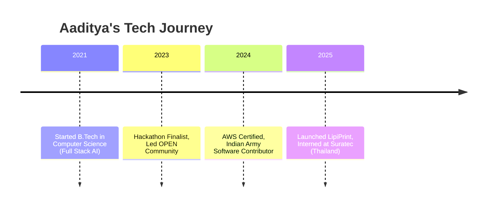

<!-- Profile Card -->

  
  <h1>Hi, I'm Aaditya Vijayvargiya 👋</h1>
  

    <b>Full-Stack Developer | Cloud & Automation Enthusiast</b> 
    <a href="mailto:aadityavv9@gmail.com">aadityavv9@gmail.com</a> •
    <a href="https://www.linkedin.com/in/aadityavv9/">LinkedIn</a> •
    <a href="https://leetcode.com/u/aadityavv9/">LeetCode</a>
  

---

<!-- Timeline Section -->
<h2>🚀 My Journey</h2>

---

<!-- Skills Section -->
<h2>🛠️ Tech Stack</h2>

  

---

<!-- Projects Grid -->
<h2>🌟 Featured Projects</h2>
<table>
  <tr>
    <td>
      <b><a href="https://github.com/Aadityavv/LipiPrint">LipiPrint</a></b> 
      City-wide cloud printing platform for Saharanpur
    </td>
    <td>
      <b><a href="https://github.com/Aadityavv/UHS-Frontend">UPES Health Services</a></b> 
      Healthcare management for 15,000+ users
    </td>
    <td>
      <b><a href="https://github.com/Aadityavv/updated-litigate">Litigate</a></b> 
      ML-powered legal case management
    </td>
  </tr>
</table>

---

<!-- Achievements Section -->
<h2>🏅 Achievements</h2>
<ul>
  <li>🥇 Hackathon Finalist (Top 1/110+ teams)</li>
  <li>🛡️ Developed mission-critical software for the Indian Army</li>
  <li>📚 AWS Certified, Open Source Contributor</li>
</ul>

---

<!-- Fun Footer -->

  

